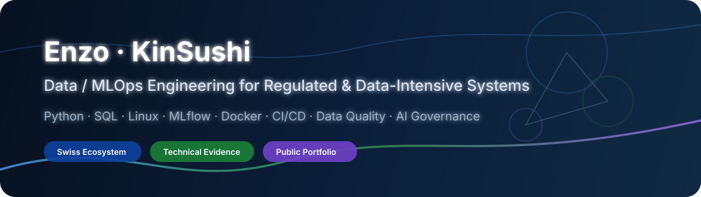
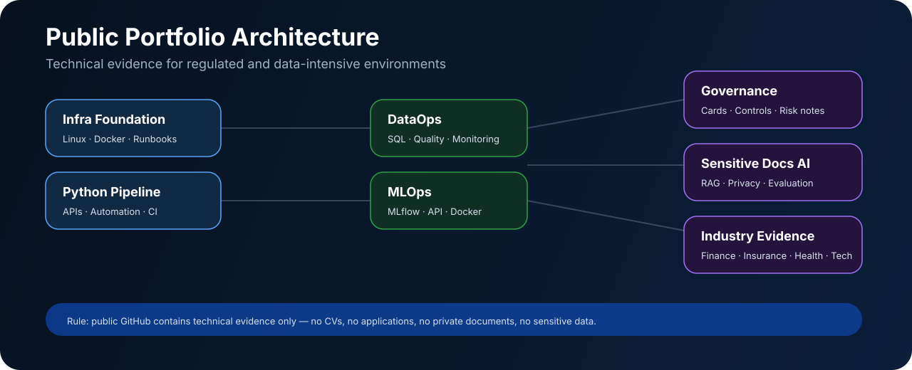

<!-- KinSushi / KinSushi - GitHub Profile README -->
<!-- Public positioning: Data / MLOps / AI systems for regulated and data-intensive environments -->
<!-- Last updated: June 2026 -->

<div align="center">



<br/>

# Enzo - KinSushi

### Junior Data / MLOps Engineer for regulated and data-intensive systems

Python | SQL | Linux | Data Quality | Monitoring | MLflow | Docker | CI/CD | AI Governance

<a href="https://www.linkedin.com/in/enzo-c-di-bacco-074842226">
  
</a>


<br/>
<br/>


</div>

---

## Public positioning

I build reliable data and ML systems for regulated and data-intensive environments: ingestion, SQL, data quality, monitoring, MLflow, Docker, CI/CD, technical documentation, model governance and AI risk controls.

This GitHub is intentionally technical and employer-neutral. It is built to speak to Swiss banking, insurance, health data, pharma/medtech, fintech, financial infrastructure, consulting, research and big-tech environments.

> Application materials are not stored here. CV variants, cover letters, job trackers, recruiter messages and employer-specific strategy stay outside public GitHub.

---

## Active portfolio repositories

| Priority | Repository | Purpose | Stack / signal |
|---:|---|---|---|
| 1 | [banking-dataops-monitoring](https://github.com/KinSushi/banking-dataops-monitoring) | Regulated-data monitoring lab: SQL controls, reconciliation, dashboard, runbooks | PostgreSQL / Python / Streamlit / DataOps |
| 2 | [fraud-mlops-control-tower](https://github.com/KinSushi/fraud-mlops-control-tower) | Synthetic risk/anomaly ML lifecycle with threshold tuning, serving and governance | scikit-learn / MLflow / FastAPI / Docker |
| 3 | [database-migration-quality-lab](https://github.com/KinSushi/database-migration-quality-lab) | Legacy-to-target migration with validation, reconciliation and rollback | PostgreSQL / SQL / Python / Data Quality |
| 4 | [secure-wealth-rag-assistant](https://github.com/KinSushi/secure-wealth-rag-assistant) | Secure RAG / LLMOps with synthetic documents, privacy and evaluation controls | RAG / LLMOps / Privacy / AI Governance |
| 5 | [jedha-rncp35288-portfolio](https://github.com/KinSushi/jedha-rncp35288-portfolio) | Public sanitized six-block Jedha RNCP35288 evidence portfolio | Data Science / MLOps / Governance |
| 6 | [sovralys-infra-lab](https://github.com/KinSushi/sovralys-infra-lab) | Personal Data / ML infrastructure lab: Ubuntu, KVM/QEMU, private networking, runbooks | Linux / KVM-QEMU / Docker / Jupyter |
| 7 | [pty-flights-pricing](https://github.com/KinSushi/pty-flights-pricing) | Production-style Python API automation pipeline with scheduling and alerting | Python / REST APIs / Cron / CI |
| 8 | [OpenClassroomsProject](https://github.com/KinSushi/OpenClassroomsProject) | Web development portfolio and RNCP38145 project delivery evidence | HTML5 / CSS3 / GitHub Pages |
| 9 | [git-workflow-demo](https://github.com/KinSushi/git-workflow-demo) | Professional Git workflow reference: SSH, branches, commits, onboarding | Git / SSH / Conventional Commits |

---

## Portfolio layers

| Layer | Repository | Evidence |
|---|---|---|
| DataOps | [banking-dataops-monitoring](https://github.com/KinSushi/banking-dataops-monitoring) | SQL controls, reconciliation, dashboard, incident runbook |
| MLOps | [fraud-mlops-control-tower](https://github.com/KinSushi/fraud-mlops-control-tower) | MLflow, threshold tuning, FastAPI, Docker, model card, data card |
| Data migration | [database-migration-quality-lab](https://github.com/KinSushi/database-migration-quality-lab) | legacy schema, migration SQL, validation, rollback |
| LLMOps / RAG | [secure-wealth-rag-assistant](https://github.com/KinSushi/secure-wealth-rag-assistant) | retrieval, prompt-injection tests, privacy controls |
| Certification evidence | [jedha-rncp35288-portfolio](https://github.com/KinSushi/jedha-rncp35288-portfolio) | six-block public evidence map |
| Infrastructure | [sovralys-infra-lab](https://github.com/KinSushi/sovralys-infra-lab) | Linux runtime, VM lifecycle, private networking |
| Automation | [pty-flights-pricing](https://github.com/KinSushi/pty-flights-pricing) | API ingestion, cron, alerts, CI |
| Web foundations | [OpenClassroomsProject](https://github.com/KinSushi/OpenClassroomsProject) | HTML/CSS, responsive delivery, GitHub Pages |

---

## Validation status

| Repository | Current public validation evidence |
|---|---|
| [banking-dataops-monitoring](https://github.com/KinSushi/banking-dataops-monitoring/blob/main/docs/local_run_report.md) | install, compileall, pytest, ruff, synthetic data generation, import check |
| [fraud-mlops-control-tower](https://github.com/KinSushi/fraud-mlops-control-tower/blob/main/docs/local_run_report.md) | install, compileall, pytest, ruff, synthetic risk data, import check, small-model training |
| [database-migration-quality-lab](https://github.com/KinSushi/database-migration-quality-lab/blob/main/docs/local_run_report.md) | install, compileall, pytest, ruff, legacy data generation, import check |
| [secure-wealth-rag-assistant](https://github.com/KinSushi/secure-wealth-rag-assistant/blob/main/docs/local_run_report.md) | install, compileall, pytest, ruff, import check, RAG demo |
| [jedha-rncp35288-portfolio](https://github.com/KinSushi/jedha-rncp35288-portfolio/blob/main/docs/local_run_report.md) | required files, six-block structure, private extension scan, private folder scan, evidence index coverage |

---

## Navigation

<table>
<tr>
<td width="50%">

### Technical maps

- [Swiss Banking & Big Tech Positioning](docs/SWISS_BANKING_BIG_TECH_POSITIONING.md)
- [Swiss Target Ecosystem](docs/SWISS_TARGET_ECOSYSTEM.md)
- [Insurance, Health, Pharma & Medtech Map](docs/INDUSTRY_MAP_INSURANCE_HEALTH.md)
- [Programming Languages Matrix](docs/PROGRAMMING_LANGUAGES_MATRIX.md)
- [Swiss Banking Data/AI Stack Map](docs/SWISS_BANKING_DATA_AI_STACK.md)

</td>
<td width="50%">

### Portfolio standards

- [Final Portfolio Audit](docs/PORTFOLIO_FINAL_AUDIT.md)
- [Visual Identity](docs/VISUAL_IDENTITY.md)
- [Project Blueprints](docs/PROJECT_BLUEPRINTS.md)
- [Portfolio Quality Gates](docs/PORTFOLIO_QUALITY_GATES.md)
- [Metrics of Success](docs/METRICS_OF_SUCCESS.md)
- [Public Repository Rules](docs/PUBLIC_REPO_RULES.md)

</td>
</tr>
</table>

---

## Target role families

| Area | Roles |
|---|---|
| Data production | Junior Data Engineer / DataOps Engineer / Application & Data Support Engineer |
| Banking / insurance IT | IT Production Engineer / Database or Data Migration Junior Engineer / Claims or policy data support |
| Analytics and risk | Risk and Compliance Data Analyst / Anomaly Analytics Junior / BI Analyst |
| Insurance / health data | Claims Data Analyst / Healthcare Data Analyst / Actuarial Data Analyst / Data Quality Analyst |
| Pharma / medtech | Clinical Data Analyst / Regulatory Data Analyst / Manufacturing Data Engineer / Research Software Engineer |
| MLOps / AI platform | Junior MLOps Engineer / ML Platform Engineer Junior / AI Platform Engineer Junior |
| Big-tech compatible path | Data Platform / Cloud-native Data Engineering / ML Infrastructure / Observability |
| Industrial / scientific systems | Industrial Data Engineer / IoT Data Engineer / Scientific Computing Engineer / Automation Data Engineer |

---

## Current track

| Track | Status | Evidence / output |
|---|---|---|
| OpenClassrooms - Developpeur WordPress / RNCP38145 | Active | Web development portfolio and project delivery discipline |
| Jedha Data Science & AI - RNCP Level 6 / Level 7 track | In progress, 2026 | Data infrastructure, EDA/statistics, ML, NLP/deep learning, MLOps, governance |
| Switzerland regulated industries transition | Active | Geneva, Lausanne, Gland, Zurich, Basel; regulated data and scale engineering |
| Production data portfolio | Active | SQL, Python, Linux, monitoring, data quality, MLflow, Docker, CI/CD |

---

## Core stack map

### Programming languages


### Production foundations


### Data / analytics


### ML / MLOps / LLMOps


### Governance / reliability focus

`data quality` | `data reconciliation` | `incident runbooks` | `auditability` | `model cards` | `data cards` | `drift monitoring` | `AI governance` | `secret hygiene`

Full stack map: [docs/SWISS_BANKING_DATA_AI_STACK.md](docs/SWISS_BANKING_DATA_AI_STACK.md)

---

## Portfolio architecture



---

## Next hardening phase

```text
2026 H2
- add real UI screenshots for dashboard, FastAPI and MLflow
- refine secret scanning into FAIL / REVIEW categories
- deepen Jedha evidence validation after each assessment block
- pin strongest repositories in portfolio order
- keep application material outside public GitHub
```

The goal is not to collect isolated notebooks. The goal is recruiter-readable technical evidence for regulated and data-intensive systems: reliable data pipelines, documented controls, monitored models and clean operational handover.

---

## Languages

| Language | Level |
|---|---|
| French | Native |
| Italian | Native |
| English | Professional - C1 |
| Spanish | Operational - B2 |
| German | B1, improving for Swiss banking and Zurich-based roles |

---

## Contact

| | |
|---|---|
| LinkedIn | [enzo-c-di-bacco-074842226](https://www.linkedin.com/in/enzo-c-di-bacco-074842226) |
| Target location | Switzerland - Geneva, Lausanne, Gland, Zurich, Basel |
| Public target domains | Data Engineering, DataOps, MLOps, Risk Analytics, Insurance Analytics, Health Data, AI Platforms, Big-tech Data Systems |

---

<sub>Public GitHub optimized for technical evidence. Application materials, private school documents, salary targets and employer-specific notes are intentionally kept outside this repository.</sub>
