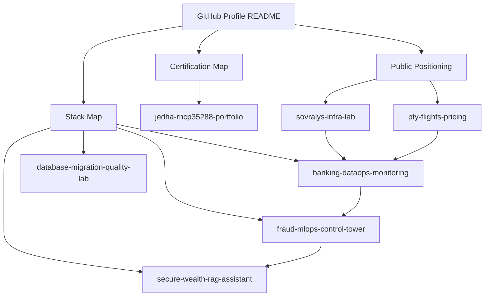

# Swiss Banking & Big Tech Positioning

**Public positioning for employability across Swiss banks, fintechs, financial infrastructure providers and Swiss big-tech environments**

DataOps · MLOps · Data Engineering · Risk Analytics · AI Governance · Platform Engineering

---

## Core positioning

> Junior Data / MLOps Engineer for regulated and large-scale technical environments.
>
> I build reliable data and ML systems: ingestion, SQL, data quality, monitoring, MLflow, Docker, CI/CD, documentation, audit evidence and AI governance.

This positioning is designed to remain employer-neutral. It speaks to Swiss banks, private banks, cantonal banks, fintechs, financial infrastructure providers, consulting firms and Swiss big-tech engineering teams.

---

## Why this is broader than one bank

The Swiss market does not ask for one single profile. It contains several technical entry points:

| Market segment | What they typically need | Public evidence to show |
|---|---|---|
| Private banks / wealth management | risk analytics, investment reporting, governance, RAG, document intelligence | `fraud-mlops-control-tower`, `secure-wealth-rag-assistant`, model cards |
| Cantonal / retail banks | SQL, production support, database operations, data quality, data migration | `banking-dataops-monitoring`, `database-migration-quality-lab` |
| Large banks / AI platforms | Databricks, Azure/AWS, Kubernetes, CI/CD, model monitoring, LLMOps | `fraud-mlops-control-tower`, `secure-wealth-rag-assistant`, stack map |
| Fintech / trading platforms | APIs, automation, monitoring, latency awareness, data integrity | `pty-flights-pricing`, `banking-dataops-monitoring`, `sovralys-infra-lab` |
| Financial infrastructure / vendors | migration, integration, DevOps, data quality, technical documentation | `database-migration-quality-lab`, `sovralys-infra-lab`, runbooks |
| Big tech / scale engineering | software quality, cloud-native systems, observability, testing, documentation | CI/CD, Docker, Kubernetes, FastAPI, tests, monitoring docs |

---

## Swiss banking families addressed

| Family | Examples of institutions | Technical message |
|---|---|---|
| Private banking / wealth | Pictet, Lombard Odier, Julius Baer, EFG, Vontobel, UBP, Mirabaud, Edmond de Rothschild, J. Safra Sarasin | Wealth/risk data, model governance, RAG, explainability, monitoring |
| Cantonal / retail banking | BCV, BCGE, BCF, BCJ, BCNe, BCVS, ZKB, LUKB, Raiffeisen, PostFinance, Banque Migros, Valiant, Cler | SQL, PostgreSQL/Oracle, DataOps, production support, data quality, migration |
| Large / international banks | UBS, J.P. Morgan Switzerland, Citi, Goldman Sachs, HSBC, BNP Paribas, Deutsche Bank Switzerland | ML platform, data platform, cloud, Kubernetes, CI/CD, observability |
| Fintech / regulated digital finance | Swissquote, Dukascopy, Yuh, Taurus, Sygnum, AMINA Bank, SIX Digital Exchange | API pipelines, operational automation, fraud analytics, monitoring, data integrity |
| Infrastructure / software providers | SIX, Avaloq, Temenos, ELCA, Adnovum, ti&m, EPAM, Deloitte, EY, Accenture, Capgemini | Data migration, integration, DevOps, cloud, governance, documentation |

---

## Big-tech compatible signal

The same portfolio should also speak to Swiss big-tech and scale-engineering teams through these signals:

| Engineering signal | Public evidence |
|---|---|
| Clean software engineering | `pytest`, `ruff`, `pre-commit`, typed config, modular Python |
| Production runtime awareness | Linux, Docker, service checks, logs, runbooks |
| Cloud-native foundations | Kubernetes, Terraform, CI/CD, observability map |
| Data scale awareness | Spark/PySpark, Databricks, Parquet, Delta/Iceberg, streaming concepts |
| ML production readiness | MLflow, model registry, API serving, drift monitoring, model card |
| LLM application awareness | RAG evaluation, vector stores, guardrails, prompt-injection tests |
| Governance and risk | data cards, model cards, risk assessments, privacy controls |

---

## Repository architecture

---

## Public project order

| Priority | Repository | Why it matters |
|---:|---|---|
| 1 | `banking-dataops-monitoring` | Best entry signal for banks: SQL, data quality, monitoring, production support |
| 2 | `fraud-mlops-control-tower` | Strong ML + MLOps + risk analytics signal |
| 3 | `jedha-rncp35288-portfolio` | Structured six-block certification evidence |
| 4 | `database-migration-quality-lab` | Useful for banks, core banking vendors and integration firms |
| 5 | `secure-wealth-rag-assistant` | Strong GenAI / RAG / private-banking signal |
| 6 | `sovralys-infra-lab` | Infrastructure maturity: Linux, VM lifecycle, private networking, recovery |
| 7 | `pty-flights-pricing` | Existing Python automation evidence: API, cron, alerting, idempotency |

---

## What stays outside GitHub

The public repository must not become an application dossier.

Keep outside GitHub:

- CV variants;
- cover letters;
- employer-specific application notes;
- job-tracking sheets;
- salary targets;
- recruiter messages;
- interview scripts;
- private school or certification documents;
- identity documents;
- contracts, invoices or CPF documents.

Public GitHub should show technical proof, not candidature material.

---

## Final public message

> I build reliable data and ML systems for regulated and large-scale environments: ingestion, SQL, data quality, monitoring, MLflow, Docker, CI/CD, technical documentation, model governance and AI risk controls.
