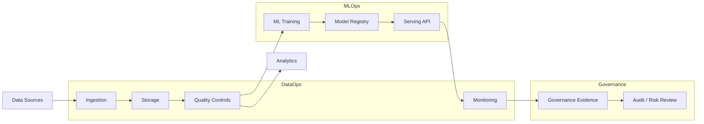

# Swiss Banking & Big Tech Data/AI Stack Map

**Technical stack map for regulated finance, MLOps, DataOps, analytics and production data systems**

Python · SQL · Data Quality · MLOps · LLMOps · Data Engineering · Analytics · Governance · Observability

---

## Scope

This document is a public technical stack map. It is not a CV, cover letter, application tracker or employer-specific candidature file.

Its purpose is to structure the tools, libraries and engineering domains needed for employability across:

- Swiss banks and private banks;
- cantonal banks and retail banks;
- fintechs and regulated financial infrastructure providers;
- consulting / integration firms serving financial institutions;
- Swiss big-tech and large-scale software engineering environments.

---

## Target public positioning

> I build reliable data and ML systems for regulated environments: ingestion, SQL, data quality, monitoring, MLflow, Docker, CI/CD, documentation, model governance and AI risk controls.

This positioning is intentionally broader than one employer. It is meant to speak to production data teams, data platforms, AI platforms, risk/compliance analytics teams and MLOps teams.

---

## Operating model

---

## Role-to-stack matrix

| Role family | Core evidence to show | Main libraries / tools |
|---|---|---|
| Data Analyst | EDA, dashboards, SQL analysis, data storytelling | `pandas`, `numpy`, `polars`, `duckdb`, `matplotlib`, `plotly`, `streamlit`, `scipy`, `statsmodels` |
| Data Scientist | ML experiments, model evaluation, explainability | `scikit-learn`, `xgboost`, `lightgbm`, `catboost`, `imbalanced-learn`, `optuna`, `shap`, `lime`, `statsmodels` |
| Data Engineer | Pipelines, orchestration, storage, schemas, APIs | `sqlalchemy`, `psycopg`, `pyarrow`, `pyspark`, `dask`, `dbt`, `airflow`, `prefect`, `dagster` |
| DataOps Engineer | Data quality, reconciliation, observability, incidents | `great_expectations`, `soda-core`, `pandera`, `dbt tests`, `openlineage`, `datahub`, `evidently`, `opentelemetry` |
| MLOps Engineer | Model registry, serving, monitoring, CI/CD, reproducibility | `mlflow`, `dvc`, `bentoml`, `fastapi`, `docker`, `kubernetes`, `helm`, `prometheus`, `grafana`, `evidently` |
| ML Engineer | Production ML, APIs, model packaging, performance | `scikit-learn`, `pytorch`, `tensorflow`, `onnx`, `fastapi`, `pydantic`, `pytest`, `ruff` |
| LLMOps / GenAI Engineer | RAG, evaluation, guardrails, vector search, privacy | `transformers`, `sentence-transformers`, `langchain`, `llamaindex`, `haystack`, `faiss`, `chromadb`, `qdrant`, `pgvector` |
| Risk / Compliance Analytics | Model risk, fairness, explainability, audit evidence | `shap`, `lime`, `fairlearn`, `aif360`, `deepchecks`, `nannyml`, `evidently`, `presidio` |
| Platform / Production Engineer | Linux, containers, monitoring, IaC, runtime stability | `docker`, `kubernetes`, `terraform`, `ansible`, `bash`, `prometheus`, `grafana`, `loki`, `opentelemetry` |

---

## Python foundations

| Category | Libraries / tools | Why it matters |
|---|---|---|
| Core runtime | `python`, `venv`, `conda`, `uv`, `pip`, `poetry` | Reproducible local and production environments |
| Code quality | `ruff`, `black`, `isort`, `mypy`, `pre-commit` | Clean, reviewable, maintainable code |
| Testing | `pytest`, `pytest-cov`, `hypothesis`, `tox` | Regression control and safer refactoring |
| Config | `pydantic`, `pydantic-settings`, `hydra`, `omegaconf`, `python-dotenv` | Typed configuration and environment isolation |
| CLI / automation | `typer`, `click`, `rich`, `tqdm` | Operator-friendly scripts and workflows |
| Logging | `logging`, `structlog`, `loguru`, `opentelemetry` | Debugging, traceability and production observability |

---

## Data analysis and BI layer

| Need | Stack |
|---|---|
| Dataframes | `pandas`, `polars`, `numpy`, `pyarrow` |
| Local analytics | `duckdb`, `sqlite`, `connectorx` |
| Statistics | `scipy`, `statsmodels`, `pingouin` |
| Visualization | `matplotlib`, `plotly`, `altair` |
| Dashboards | `streamlit`, `dash`, `panel`, `gradio` |
| BI integration | Power BI, Tableau, Superset, Metabase |
| Notebook workflow | `jupyterlab`, `ipykernel`, `nbconvert`, `papermill` |

Portfolio evidence:

- SQL analysis notebook;
- operational dashboard;
- KPI definitions;
- data dictionary;
- reproducible notebook-to-script path.

---

## Data engineering layer

| Need | Stack |
|---|---|
| SQL databases | PostgreSQL, Oracle, SQL Server, SQLite, DuckDB |
| Python DB access | `sqlalchemy`, `psycopg`, `asyncpg`, `pyodbc`, `oracledb` |
| File formats | Parquet, Delta Lake, Iceberg, CSV, JSON, Avro |
| Python file tooling | `pyarrow`, `fastparquet`, `delta-rs`, `smart_open` |
| Batch processing | `pyspark`, `dask`, `ray`, `polars` |
| Orchestration | Airflow, Prefect, Dagster, Argo Workflows |
| Transformation | dbt, SQL models, Python transforms |
| Messaging / streaming | Kafka, Redpanda, `confluent-kafka`, Spark Structured Streaming |
| Metadata / lineage | OpenLineage, Marquez, DataHub, OpenMetadata |

Portfolio evidence:

- `banking-dataops-monitoring`;
- `database-migration-quality-lab`;
- schema design;
- data quality checks;
- reconciliation reports;
- incident runbook.

---

## DataOps and quality controls

| Control type | Tools / libraries |
|---|---|
| Data validation | `great_expectations`, `soda-core`, `pandera`, `pydantic` |
| dbt quality | dbt tests, Elementary, dbt artifacts |
| Drift and monitoring | `evidently`, `nannyml`, `whylogs`, `deepchecks` |
| Lineage | OpenLineage, Marquez, DataHub, OpenMetadata |
| Observability | Prometheus, Grafana, Loki, OpenTelemetry |
| Incident documentation | runbooks, post-mortems, control matrices |

Bank-compatible evidence:

- data controls matrix;
- data dictionary;
- reconciliation queries;
- anomaly queries;
- operational alerting;
- clear rollback plan.

---

## Machine learning layer

| Need | Stack |
|---|---|
| Classical ML | `scikit-learn`, `xgboost`, `lightgbm`, `catboost` |
| Imbalanced data | `imbalanced-learn`, threshold tuning, PR-AUC focus |
| Optimization | `optuna`, `hyperopt`, `ray[tune]` |
| Explainability | `shap`, `lime`, partial dependence, permutation importance |
| Model validation | cross-validation, backtesting, holdout strategy, leakage checks |
| Causal / econometrics | `dowhy`, `econml`, `statsmodels`, `arch` |
| Fairness | `fairlearn`, `aif360` |

Bank-compatible ML use cases:

- fraud / anomaly detection;
- churn / next-best-action;
- credit-risk simulation on synthetic data;
- operational risk classification;
- wealth-management document tagging.

---

## Deep learning, NLP and LLMOps

| Need | Stack |
|---|---|
| Deep learning | `pytorch`, `lightning`, `tensorflow`, `keras`, `jax` |
| Model exchange | ONNX, `onnxruntime`, OpenVINO |
| NLP | `spacy`, `nltk`, `gensim`, `transformers`, `tokenizers` |
| Embeddings | `sentence-transformers`, OpenAI / Azure OpenAI embeddings, HF models |
| RAG orchestration | `langchain`, `llamaindex`, Haystack, DSPy |
| Vector search | FAISS, Chroma, Qdrant, Weaviate, Milvus, pgvector |
| LLM evaluation | RAGAS, DeepEval, promptfoo, custom retrieval/faithfulness tests |
| Privacy / PII | Microsoft Presidio, anonymization rules, synthetic datasets |
| Guardrails | NeMo Guardrails, Guardrails AI, custom policy filters |

Public portfolio rule:

- use synthetic client profiles;
- no real bank data;
- no scraped private documents;
- document prompt-injection tests and hallucination checks.

---

## MLOps and production ML layer

| Need | Stack |
|---|---|
| Experiment tracking | MLflow, Weights & Biases, Neptune, Comet |
| Data/model versioning | DVC, LakeFS, Git LFS, MLflow model registry |
| Serving | FastAPI, BentoML, KServe, Seldon Core, TorchServe |
| Packaging | Docker, BuildKit, Python wheels, OCI images |
| Orchestration | Kubernetes, Helm, Argo Workflows, Airflow, Prefect, Dagster |
| CI/CD | GitHub Actions, GitLab CI, Azure DevOps, Jenkins |
| Monitoring | Evidently, NannyML, WhyLabs, Prometheus, Grafana, OpenTelemetry |
| Testing | unit tests, integration tests, API tests, data tests, model tests |
| Governance | model cards, data cards, risk assessments, deployment runbooks |

Portfolio evidence:

- `fraud-mlops-control-tower`;
- MLflow run screenshots;
- FastAPI `/predict` endpoint;
- Dockerized service;
- CI pipeline;
- monitoring plan;
- model card and data card.

---

## Cloud and platform layer

| Platform | Relevant services |
|---|---|
| Azure | Azure Databricks, AKS, Azure Machine Learning, Azure DevOps, Azure Storage, Microsoft Entra |
| AWS | SageMaker, Bedrock, EKS, ECS, Lambda, S3, Glue, Athena, Redshift, CloudWatch |
| GCP | Vertex AI, BigQuery, GKE, Cloud Run, Dataflow, Pub/Sub, Cloud Monitoring |
| Databricks | Delta Lake, MLflow, Unity Catalog, Feature Engineering, Workflows, Model Serving |
| Snowflake | Snowpark, Streams/Tasks, data sharing, governance, Cortex AI |
| Kubernetes | deployments, jobs, services, ingress, secrets, config maps, autoscaling |
| IaC | Terraform, OpenTofu, Bicep, CloudFormation, Ansible |

Swiss-market emphasis:

- Azure / Databricks / Kubernetes for enterprise platforms;
- PostgreSQL / Oracle / SQL Server for banking systems;
- Terraform for reproducible infrastructure;
- observability and audit documentation for regulated environments.

---

## Governance, risk and security layer

| Need | Stack / method |
|---|---|
| Secret hygiene | `.gitignore`, `detect-secrets`, TruffleHog, GitHub secret scanning |
| Dependency security | `pip-audit`, Safety, Dependabot, Snyk |
| Static analysis | `bandit`, Semgrep, CodeQL |
| Privacy | Microsoft Presidio, synthetic data, PII masking, data minimization |
| Model risk | model cards, validation reports, assumptions, limitations |
| AI governance | risk assessment, human review policy, audit logs, monitoring plan |
| Fairness / bias | `fairlearn`, `aif360`, subgroup metrics |
| Explainability | `shap`, `lime`, feature importance, counterfactual analysis |

Bank-compatible evidence:

- no secrets in public repos;
- synthetic data only;
- documented limitations;
- clear monitoring and rollback plan;
- decision records and control matrices.

---

## Public project architecture

| Repository | Purpose | Role families addressed |
|---|---|---|
| `sovralys-infra-lab` | Linux/KVM infrastructure lab and operational runbooks | IT Production, DataOps, MLOps foundations |
| `pty-flights-pricing` | Production-style Python API pipeline with scheduling and alerting | DataOps, Application Support, Data Engineering |
| `banking-dataops-monitoring` | SQL, PostgreSQL, data quality, reconciliation and monitoring | DataOps, Data Engineer, Banking IT |
| `fraud-mlops-control-tower` | Fraud/risk ML pipeline with MLflow, API serving and monitoring | Data Scientist, MLOps, Risk Analytics |
| `database-migration-quality-lab` | Legacy-to-target migration, validation and reconciliation | Data Engineer, Data Migration, Banking IT |
| `secure-wealth-rag-assistant` | RAG/LLMOps with privacy, evaluation and governance | GenAI, LLMOps, Wealth/Risk Analytics |
| `jedha-rncp35288-portfolio` | Six-block certification evidence | Training evidence, not application material |

---

## Non-goals

This repository map intentionally excludes:

- CVs;
- cover letters;
- employer-specific application notes;
- interview answers;
- salary targets;
- private job-tracking material;
- real banking data;
- secrets, tokens, hostnames, keys or licenses.

Those artifacts belong outside public GitHub.
# Swiss Banking & Big Tech Data/AI Stack Map

**Technical stack map for regulated finance, MLOps, DataOps, analytics and production data systems**

Python · SQL · Data Quality · MLOps · LLMOps · Data Engineering · Analytics · Governance · Observability

---

## Scope

This document is a public technical stack map. It is not a CV, cover letter, application tracker or employer-specific candidature file.

Its purpose is to structure the tools, libraries and engineering domains needed for employability across:

- Swiss banks and private banks;
- cantonal banks and retail banks;
- fintechs and regulated financial infrastructure providers;
- consulting / integration firms serving financial institutions;
- Swiss big-tech and large-scale software engineering environments.

---

## Target public positioning

> I build reliable data and ML systems for regulated environments: ingestion, SQL, data quality, monitoring, MLflow, Docker, CI/CD, documentation, model governance and AI risk controls.

This positioning is intentionally broader than one employer. It is meant to speak to production data teams, data platforms, AI platforms, risk/compliance analytics teams and MLOps teams.

---

## Operating model

---

## Role-to-stack matrix

| Role family | Core evidence to show | Main libraries / tools |
|---|---|---|
| Data Analyst | EDA, dashboards, SQL analysis, data storytelling | `pandas`, `numpy`, `polars`, `duckdb`, `matplotlib`, `plotly`, `streamlit`, `scipy`, `statsmodels` |
| Data Scientist | ML experiments, model evaluation, explainability | `scikit-learn`, `xgboost`, `lightgbm`, `catboost`, `imbalanced-learn`, `optuna`, `shap`, `lime`, `statsmodels` |
| Data Engineer | Pipelines, orchestration, storage, schemas, APIs | `sqlalchemy`, `psycopg`, `pyarrow`, `pyspark`, `dask`, `dbt`, `airflow`, `prefect`, `dagster` |
| DataOps Engineer | Data quality, reconciliation, observability, incidents | `great_expectations`, `soda-core`, `pandera`, `dbt tests`, `openlineage`, `datahub`, `evidently`, `opentelemetry` |
| MLOps Engineer | Model registry, serving, monitoring, CI/CD, reproducibility | `mlflow`, `dvc`, `bentoml`, `fastapi`, `docker`, `kubernetes`, `helm`, `prometheus`, `grafana`, `evidently` |
| ML Engineer | Production ML, APIs, model packaging, performance | `scikit-learn`, `pytorch`, `tensorflow`, `onnx`, `fastapi`, `pydantic`, `pytest`, `ruff` |
| LLMOps / GenAI Engineer | RAG, evaluation, guardrails, vector search, privacy | `transformers`, `sentence-transformers`, `langchain`, `llamaindex`, `haystack`, `faiss`, `chromadb`, `qdrant`, `pgvector` |
| Risk / Compliance Analytics | Model risk, fairness, explainability, audit evidence | `shap`, `lime`, `fairlearn`, `aif360`, `deepchecks`, `nannyml`, `evidently`, `presidio` |
| Platform / Production Engineer | Linux, containers, monitoring, IaC, runtime stability | `docker`, `kubernetes`, `terraform`, `ansible`, `bash`, `prometheus`, `grafana`, `loki`, `opentelemetry` |

---

## Python foundations

| Category | Libraries / tools | Why it matters |
|---|---|---|
| Core runtime | `python`, `venv`, `conda`, `uv`, `pip`, `poetry` | Reproducible local and production environments |
| Code quality | `ruff`, `black`, `isort`, `mypy`, `pre-commit` | Clean, reviewable, maintainable code |
| Testing | `pytest`, `pytest-cov`, `hypothesis`, `tox` | Regression control and safer refactoring |
| Config | `pydantic`, `pydantic-settings`, `hydra`, `omegaconf`, `python-dotenv` | Typed configuration and environment isolation |
| CLI / automation | `typer`, `click`, `rich`, `tqdm` | Operator-friendly scripts and workflows |
| Logging | `logging`, `structlog`, `loguru`, `opentelemetry` | Debugging, traceability and production observability |

---

## Data analysis and BI layer

| Need | Stack |
|---|---|
| Dataframes | `pandas`, `polars`, `numpy`, `pyarrow` |
| Local analytics | `duckdb`, `sqlite`, `connectorx` |
| Statistics | `scipy`, `statsmodels`, `pingouin` |
| Visualization | `matplotlib`, `plotly`, `altair` |
| Dashboards | `streamlit`, `dash`, `panel`, `gradio` |
| BI integration | Power BI, Tableau, Superset, Metabase |
| Notebook workflow | `jupyterlab`, `ipykernel`, `nbconvert`, `papermill` |

Portfolio evidence:

- SQL analysis notebook;
- operational dashboard;
- KPI definitions;
- data dictionary;
- reproducible notebook-to-script path.

---

## Data engineering layer

| Need | Stack |
|---|---|
| SQL databases | PostgreSQL, Oracle, SQL Server, SQLite, DuckDB |
| Python DB access | `sqlalchemy`, `psycopg`, `asyncpg`, `pyodbc`, `oracledb` |
| File formats | Parquet, Delta Lake, Iceberg, CSV, JSON, Avro |
| Python file tooling | `pyarrow`, `fastparquet`, `delta-rs`, `smart_open` |
| Batch processing | `pyspark`, `dask`, `ray`, `polars` |
| Orchestration | Airflow, Prefect, Dagster, Argo Workflows |
| Transformation | dbt, SQL models, Python transforms |
| Messaging / streaming | Kafka, Redpanda, `confluent-kafka`, Spark Structured Streaming |
| Metadata / lineage | OpenLineage, Marquez, DataHub, OpenMetadata |

Portfolio evidence:

- `banking-dataops-monitoring`;
- `database-migration-quality-lab`;
- schema design;
- data quality checks;
- reconciliation reports;
- incident runbook.

---

## DataOps and quality controls

| Control type | Tools / libraries |
|---|---|
| Data validation | `great_expectations`, `soda-core`, `pandera`, `pydantic` |
| dbt quality | dbt tests, Elementary, dbt artifacts |
| Drift and monitoring | `evidently`, `nannyml`, `whylogs`, `deepchecks` |
| Lineage | OpenLineage, Marquez, DataHub, OpenMetadata |
| Observability | Prometheus, Grafana, Loki, OpenTelemetry |
| Incident documentation | runbooks, post-mortems, control matrices |

Bank-compatible evidence:

- data controls matrix;
- data dictionary;
- reconciliation queries;
- anomaly queries;
- operational alerting;
- clear rollback plan.

---

## Machine learning layer

| Need | Stack |
|---|---|
| Classical ML | `scikit-learn`, `xgboost`, `lightgbm`, `catboost` |
| Imbalanced data | `imbalanced-learn`, threshold tuning, PR-AUC focus |
| Optimization | `optuna`, `hyperopt`, `ray[tune]` |
| Explainability | `shap`, `lime`, partial dependence, permutation importance |
| Model validation | cross-validation, backtesting, holdout strategy, leakage checks |
| Causal / econometrics | `dowhy`, `econml`, `statsmodels`, `arch` |
| Fairness | `fairlearn`, `aif360` |

Bank-compatible ML use cases:

- fraud / anomaly detection;
- churn / next-best-action;
- credit-risk simulation on synthetic data;
- operational risk classification;
- wealth-management document tagging.

---

## Deep learning, NLP and LLMOps

| Need | Stack |
|---|---|
| Deep learning | `pytorch`, `lightning`, `tensorflow`, `keras`, `jax` |
| Model exchange | ONNX, `onnxruntime`, OpenVINO |
| NLP | `spacy`, `nltk`, `gensim`, `transformers`, `tokenizers` |
| Embeddings | `sentence-transformers`, OpenAI / Azure OpenAI embeddings, HF models |
| RAG orchestration | `langchain`, `llamaindex`, Haystack, DSPy |
| Vector search | FAISS, Chroma, Qdrant, Weaviate, Milvus, pgvector |
| LLM evaluation | RAGAS, DeepEval, promptfoo, custom retrieval/faithfulness tests |
| Privacy / PII | Microsoft Presidio, anonymization rules, synthetic datasets |
| Guardrails | NeMo Guardrails, Guardrails AI, custom policy filters |

Public portfolio rule:

- use synthetic client profiles;
- no real bank data;
- no scraped private documents;
- document prompt-injection tests and hallucination checks.

---

## MLOps and production ML layer

| Need | Stack |
|---|---|
| Experiment tracking | MLflow, Weights & Biases, Neptune, Comet |
| Data/model versioning | DVC, LakeFS, Git LFS, MLflow model registry |
| Serving | FastAPI, BentoML, KServe, Seldon Core, TorchServe |
| Packaging | Docker, BuildKit, Python wheels, OCI images |
| Orchestration | Kubernetes, Helm, Argo Workflows, Airflow, Prefect, Dagster |
| CI/CD | GitHub Actions, GitLab CI, Azure DevOps, Jenkins |
| Monitoring | Evidently, NannyML, WhyLabs, Prometheus, Grafana, OpenTelemetry |
| Testing | unit tests, integration tests, API tests, data tests, model tests |
| Governance | model cards, data cards, risk assessments, deployment runbooks |

Portfolio evidence:

- `fraud-mlops-control-tower`;
- MLflow run screenshots;
- FastAPI `/predict` endpoint;
- Dockerized service;
- CI pipeline;
- monitoring plan;
- model card and data card.

---

## Cloud and platform layer

| Platform | Relevant services |
|---|---|
| Azure | Azure Databricks, AKS, Azure Machine Learning, Azure DevOps, Azure Storage, Microsoft Entra |
| AWS | SageMaker, Bedrock, EKS, ECS, Lambda, S3, Glue, Athena, Redshift, CloudWatch |
| GCP | Vertex AI, BigQuery, GKE, Cloud Run, Dataflow, Pub/Sub, Cloud Monitoring |
| Databricks | Delta Lake, MLflow, Unity Catalog, Feature Engineering, Workflows, Model Serving |
| Snowflake | Snowpark, Streams/Tasks, data sharing, governance, Cortex AI |
| Kubernetes | deployments, jobs, services, ingress, secrets, config maps, autoscaling |
| IaC | Terraform, OpenTofu, Bicep, CloudFormation, Ansible |

Swiss-market emphasis:

- Azure / Databricks / Kubernetes for enterprise platforms;
- PostgreSQL / Oracle / SQL Server for banking systems;
- Terraform for reproducible infrastructure;
- observability and audit documentation for regulated environments.

---

## Governance, risk and security layer

| Need | Stack / method |
|---|---|
| Secret hygiene | `.gitignore`, `detect-secrets`, TruffleHog, GitHub secret scanning |
| Dependency security | `pip-audit`, Safety, Dependabot, Snyk |
| Static analysis | `bandit`, Semgrep, CodeQL |
| Privacy | Microsoft Presidio, synthetic data, PII masking, data minimization |
| Model risk | model cards, validation reports, assumptions, limitations |
| AI governance | risk assessment, human review policy, audit logs, monitoring plan |
| Fairness / bias | `fairlearn`, `aif360`, subgroup metrics |
| Explainability | `shap`, `lime`, feature importance, counterfactual analysis |

Bank-compatible evidence:

- no secrets in public repos;
- synthetic data only;
- documented limitations;
- clear monitoring and rollback plan;
- decision records and control matrices.

---

## Public project architecture

| Repository | Purpose | Role families addressed |
|---|---|---|
| `sovralys-infra-lab` | Linux/KVM infrastructure lab and operational runbooks | IT Production, DataOps, MLOps foundations |
| `pty-flights-pricing` | Production-style Python API pipeline with scheduling and alerting | DataOps, Application Support, Data Engineering |
| `banking-dataops-monitoring` | SQL, PostgreSQL, data quality, reconciliation and monitoring | DataOps, Data Engineer, Banking IT |
| `fraud-mlops-control-tower` | Fraud/risk ML pipeline with MLflow, API serving and monitoring | Data Scientist, MLOps, Risk Analytics |
| `database-migration-quality-lab` | Legacy-to-target migration, validation and reconciliation | Data Engineer, Data Migration, Banking IT |
| `secure-wealth-rag-assistant` | RAG/LLMOps with privacy, evaluation and governance | GenAI, LLMOps, Wealth/Risk Analytics |
| `jedha-rncp35288-portfolio` | Six-block certification evidence | Training evidence, not application material |

---

## Non-goals

This repository map intentionally excludes:

- CVs;
- cover letters;
- employer-specific application notes;
- interview answers;
- salary targets;
- private job-tracking material;
- real banking data;
- secrets, tokens, hostnames, keys or licenses.

Those artifacts belong outside public GitHub.
