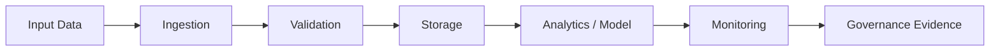

# `<repository-name>`

<div align="center">

**One-line project summary**

Python · SQL · Docker · Data Quality · Monitoring · Governance


</div>

---

## Executive summary

Describe the project in 3–5 lines:

- what problem it solves;
- what technical evidence it provides;
- why it matters for regulated finance or large-scale engineering.

---

## Documentation index

| Document | Purpose |
|---|---|
| [PORTFOLIO.md](PORTFOLIO.md) | Recruiter-readable technical signal |
| [docs/architecture.md](docs/architecture.md) | System architecture |
| [docs/incident_runbook.md](docs/incident_runbook.md) | Operations and failure handling |
| [docs/controls_matrix.md](docs/controls_matrix.md) | Data/model controls |

---

## Problem statement

Explain the business or engineering problem.

---

## Architecture



---

## Key features

| Feature | Engineering signal |
|---|---|
| `<feature>` | `<signal>` |

---

## Tech stack

| Layer | Technology |
|---|---|
| Language | Python |
| Storage | PostgreSQL / DuckDB / Parquet |
| Quality | SQL checks / Pandera / Great Expectations |
| Serving | FastAPI / Streamlit |
| MLOps | MLflow / Docker / CI |
| Monitoring | Evidently / logs / dashboard |

---

## Setup

```bash
# clone
git clone https://github.com/KinSushi/<repository-name>.git
cd <repository-name>

# install
python -m venv .venv
source .venv/bin/activate
pip install -r requirements.txt

# run
python src/main.py
```

---

## Quality controls

| Control | Purpose | Evidence |
|---|---|---|
| Data validation | Detect bad records | `sql/data_quality_checks.sql` |
| Tests | Prevent regressions | `tests/` |
| Runbook | Operational handover | `docs/incident_runbook.md` |
| Governance | Audit evidence | `docs/` |

---

## Portfolio signal

This repository proves:

- `<skill_1>`;
- `<skill_2>`;
- `<skill_3>`;
- `<skill_4>`.

---

## Non-goals

This project does not contain:

- real banking data;
- real client data;
- CVs or application material;
- secrets or private infrastructure identifiers;
- production investment/fraud/credit decisions.

---

<sub>Public repository. Synthetic or open data only. No application material.</sub>
