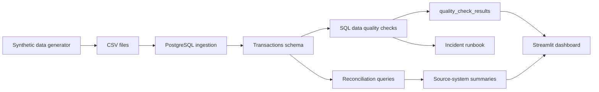

# Architecture — Banking DataOps Monitoring

## Purpose

This document describes the executable architecture of the `banking-dataops-monitoring` starter.

The project demonstrates a regulated-data monitoring pattern using synthetic data only.

---

## Architecture diagram



---

## Components

| Component | Path | Purpose |
|---|---|---|
| Synthetic data generator | `src/generate_synthetic_data.py` | Creates fake customers, accounts and transactions |
| PostgreSQL schema | `sql/00_schema.sql` | Defines tables for customers, accounts, transactions and quality results |
| Ingestion runner | `src/ingest_transactions.py` | Loads generated CSV files into PostgreSQL |
| Quality runner | `src/quality_checks.py` | Runs quality controls and persists results |
| Reconciliation runner | `src/reconciliation.py` | Summarizes transaction counts and amounts by source system |
| Dashboard | `dashboard/streamlit_app.py` | Displays quality status, volume and source-system summaries |
| Controls matrix | `docs/controls_matrix.md` | Maps controls to risks and evidence |
| Incident runbook | `docs/incident_runbook.md` | Documents investigation and response workflow |

---

## Local execution flow

```bash
make up
make generate
make ingest
make quality
make reconcile
make dashboard
```

---

## Data model

```text
customers -> accounts -> transactions -> quality_check_results
```

The model is intentionally simple and readable. It is designed to demonstrate data quality, referential integrity and reconciliation patterns rather than to mirror a production core-banking schema.

---

## Public-safety boundary

This architecture must use synthetic or open data only. No real banking, insurance, health, client, employer or private data belongs in this project.
